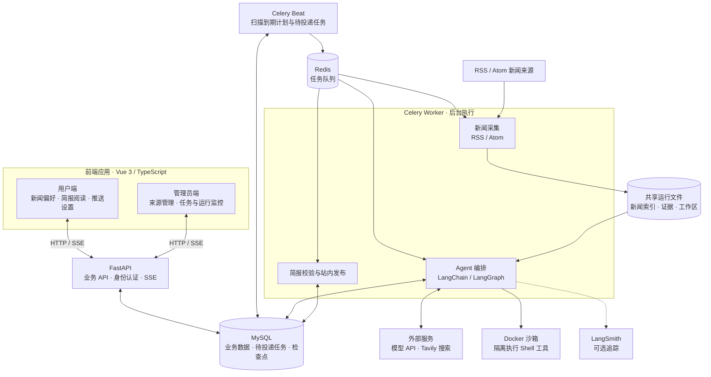

<div align="center">

<h1>🐦 知更 · ZhigeNews</h1>

<p><strong>基于 Agent 的新闻推送平台，让值得关注的新闻主动找到你。</strong></p>

<p>
  
  
  
  
  <a href="LICENSE"></a>
</p>

<p>
  
  
  
  
  
  <br />
  
  
  
  
  
</p>

<p>
  <a href="#-项目简介">📖 项目简介</a> ·
  <a href="#-核心特性">✨ 核心特性</a> ·
  <a href="#-项目结构">🏗️ 项目结构</a> ·
  <a href="#-快速开始">🚀 快速开始</a> ·
  <a href="#-许可证">📄 许可证</a>
</p>


</div>

## 📖 项目简介

**知更（ZhigeNews）是一个基于 Agent 的新闻推送平台。** 你只需描述感兴趣的话题、关键词和背景，Agent 就会从订阅的新闻来源中寻找相关报道，结合联网搜索整理信息，生成包含标题、导语、新闻摘要和原文引用的个性化简报，并按设定时间推送到站内。

项目采用前后端分离架构：用户端用于发现话题、管理偏好和阅读简报，管理员端用于维护新闻来源、查看任务和排查运行过程；后端通过 LangChain / LangGraph 编排 Agent，由 Celery 执行采集、生成和发布任务。

> 当前版本为 v1.0.0，处于最终验收阶段。真实模型、Tavily 与完整业务链路的验收进度见 [实现与验收入口](docs/releases/v1.0.0/IMPLEMENTATION.md)。

## ✨ 核心特性

| 特性 | 说明 |
| --- | --- |
| **个性化新闻发现** | 通过自然语言设置关注话题、关键词与背景，按用户偏好筛选新闻，支持主动生成简报。 |
| **Agent 自主编排** | 基于 LangChain / LangGraph 执行检索、阅读和整理，支持子 Agent 分工、上下文摘要与 MySQL 检查点恢复。 |
| **多来源采集与搜索** | 支持 RSS / Atom 订阅采集，内置新闻来源目录，并通过 Tavily 补充联网检索。 |
| **有据可查的简报** | 保留新闻来源、原文链接和证据引用，发布前校验简报结构与引用，方便回到原报道核实信息。 |
| **每日定时推送** | 按北京时间设置每日站内推送时间，后台完成生成与发布，历史简报可随时回看。 |
| **独立管理控制台** | 管理新闻来源与采集状态，查看任务进度、运行事件和发布结果，支持失败排查与重试。 |
| **可观测的隔离执行** | 通过 SSE 查看运行事件，可选接入 LangSmith 追踪；Agent 的 Shell 工具在 Docker 沙箱内运行，并受执行预算约束。 |
| **可自行部署** | 提供 Docker Compose 编排和 GitHub Actions 部署流程，模型连接通过后端环境变量配置。 |

## 🏗️ 项目结构

### 📂 目录结构

```text
zhigenews/
├── apps/
│   ├── user-web/                 # 用户端：偏好、简报、推送设置
│   └── admin-web/                # 管理端：来源、任务、运行记录
├── packages/
│   ├── api-client/               # 共享 API 契约、客户端与 SSE 支持
│   └── ui/                       # 共享组件、品牌资源与样式变量
├── backend/
│   ├── src/zhigenews/
│   │   ├── gateway.py            # FastAPI HTTP / SSE 入口
│   │   ├── application.py        # 应用业务服务
│   │   ├── workers.py            # Celery 任务、调度与发布
│   │   ├── execution.py          # Agent 运行与结果处理
│   │   ├── runtime_config.py     # Agent 提示词、工具与预算
│   │   ├── harness/              # Agent 运行时、检查点与沙箱
│   │   └── ingestion/            # RSS / Atom 采集与新闻索引
│   ├── migrations/               # 数据库迁移
│   └── tests/                    # 后端测试
├── infra/deploy/                 # 生产编排、HTTPS 与部署脚本
├── .github/workflows/            # GitHub Actions 自动部署
├── scripts/                     # 前端契约生成等工程脚本
├── docs/                        # 开发、部署、设计与版本文档
│   └── releases/v1.0.0/draft/prototype/  # 独立原型（模拟数据）
└── compose.yaml                 # 本地 MySQL、Redis 与后端编排
```

### 🧩 系统架构



API 将生成请求持久化，Beat 将到期任务投递到 Redis，Worker 执行采集、Agent 生成和站内发布。新闻索引与运行证据保存在共享文件卷，业务记录和 Agent 检查点保存在 MySQL；前端通过 API 读取简报及进度，管理员可订阅详细运行事件。

## 🚀 快速开始

以下使用 **Docker 运行后端，宿主机运行前端**。准备 Git、Node.js 24（最低 22.12）、Python 3.12、[uv](https://docs.astral.sh/uv/) 和支持 Linux 容器的 Docker Compose；Windows 可使用 Docker Desktop 的 Linux engine。所有命令均在仓库根目录执行。

### 📦 1. 获取代码与依赖

```sh
git clone https://github.com/ZimaAI/zhigenews.git
cd zhigenews
npm ci
uv sync --project backend --frozen
```

### ⚙️ 2. 配置环境变量

将 [backend/.env.example](backend/.env.example) 复制为 `backend/.env`；已有配置时直接编辑，保留原有密钥。填写以下字段：

| 配置项 | 用途 |
| --- | --- |
| `SECRET_ENCRYPTION_KEY` | Fernet 加密密钥，用于保护敏感配置。 |
| `IP_HASH_KEY` | 独立的随机密钥，用于 IP 哈希。 |
| `ADMIN_EMAIL` / `ADMIN_PASSWORD` | 初始化管理员账号，密码至少 12 个字符。 |
| `OPENAI_BASE_URL` / `OPENAI_MODEL` / `OPENAI_API_KEY` | 模型服务地址、模型名称与 API 密钥；模型需支持工具调用。 |
| `TAVILY_API_KEY` | Agent 联网补充搜索使用的 API 密钥。 |

可用下面两条命令分别生成 `SECRET_ENCRYPTION_KEY` 和 `IP_HASH_KEY`，将输出填入对应字段：

```sh
uv run --project backend python -c "from cryptography.fernet import Fernet; print(Fernet.generate_key().decode())"
uv run --project backend python -c "import secrets; print(secrets.token_hex(32))"
```

本地数据库与 Redis 配置可沿用模板；Compose 会为容器设置内部连接地址。模型及搜索密钥只配置在后端。摘要模型和 LangSmith 追踪为可选配置，详见 [开发与运维指南](docs/development.md#配置与接口)。

### 🐳 3. 启动后端

```sh
docker compose up -d --wait mysql redis
docker compose --profile app build api
docker compose --profile app run --rm api alembic upgrade head
docker compose --profile app run --rm api python -m zhigenews.cli init
docker compose --profile app up -d api worker beat
```

初始化会创建管理员并添加默认 RSS 来源。`api`、`worker`、`beat` 共同完成生成与推送，三者都需要启动。

### 🌐 4. 启动前端并体验

分别打开两个终端，在仓库根目录运行：

```sh
# 终端一：用户端
npm run dev:user
```

```sh
# 终端二：管理员端
npm run dev:admin
```

| 入口 | 地址 |
| --- | --- |
| 用户端 | [http://127.0.0.1:5173](http://127.0.0.1:5173) |
| 管理员端 | [http://127.0.0.1:5174](http://127.0.0.1:5174) |
| API 文档 | [http://127.0.0.1:18000/docs](http://127.0.0.1:18000/docs) |
| 健康检查 | [http://127.0.0.1:18000/healthz](http://127.0.0.1:18000/healthz) |

打开用户端，设置新闻偏好并生成第一份简报；管理员端使用 `.env` 中配置的账号登录，可检查来源采集和任务执行情况。

**部署到服务器：** 按 [部署指南](docs/deployment.md) 配置 Linux 服务器、双域名及 GitHub Actions Secrets，使用 `infra/deploy/` 的生产编排。推送 `main` 或手动触发工作流后，将构建 GHCR 镜像并经 SSH 部署，包含 HTTPS、数据库迁移、备份和回退流程。

更多开发、VS Code 调试、测试与配置说明见 [开发与运维指南](docs/development.md)；前端构建可执行 `npm run build`。

## 📄 许可证

本项目采用 [MIT License](LICENSE) 开源。
