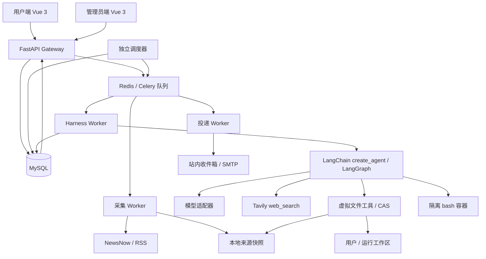

# 系统架构（DISCOVER 草稿）

本文件是贴合需求的设计建议，尚未冻结；代码和接口兼容性均待实施验证。外部事实与具体源码出处见文末及三份研究报告。

## 结构与依赖方向



一个后端代码库，按进程职责运行 API、调度器、采集/Agent/投递 worker；不是多个独立微服务。Gateway 不实现模型循环，Harness 不依赖 FastAPI 的 Request/路由对象。任务创建 HTTP 返回 202 和 run ID，耗时工作进队列；SSE 从持久事件记录追赶，Redis 可辅助唤醒但不是事件权威源。

建议源码布局：

```text
backend/src/zhigenews/
  gateway/         # auth、user/admin routers、DTO、SSE、错误映射
  application/     # 用例、事务、简报发布与投递编排
  domain/          # 用户偏好、来源、简报、运行、投递、评估规则
  harness/
    assembly/      # create_agent 与配置/提示词版本
    runtime/       # state、context、取消、预算、子任务
    middleware/    # 消息修复、摘要、上下文渲染、限制、事件
    tools/         # 六个必需工具 + 受控子任务委派
    sandbox/       # 虚拟路径、CAS 文件服务、bash backend
    memory/        # MySQL checkpointer/store、用户记忆
    models/        # 提供商适配、模型能力与 usage
  ingestion/       # newsnow、rss、规范化、快照管理
  infrastructure/ # SQLAlchemy、队列、凭据、HTTP、邮件
  workers/         # 任务入口和调度器
apps/user-web/     # 独立 package / 构建 / 部署入口
apps/admin-web/    # 独立 package / 构建 / 部署入口
packages/ui/       # 共用语义组件；两端主题分别遵循 design-user.md / design.md
packages/api-client/ # 从唯一契约生成的客户端
```

## 数据库与执行一致性

SQLAlchemy 2 + Alembic，目标 MySQL 8.4 LTS/InnoDB/utf8mb4；UTC 存储时间，用户设置 IANA 时区。初步实体如下，不冒充完整迁移定义：

| 组 | 主要对象 | 关键不变量 |
| --- | --- | --- |
| 账户 | users、sessions、user_preferences、delivery_settings | user/admin 权限；偏好有 version；目的地验证状态独立 |
| 采集 | sources、source_fetches、source_snapshots、news_items | 源 ID 固定；快照不可变；新闻原链接/来源时间/抓取时间分别记录 |
| Agent 配置 | model_endpoints、secret_refs、agent_config_versions | 数据库存加密凭据；主加密密钥来自环境；运行绑定配置版本 |
| 运行 | agent_runs、run_events、message_journal、subtasks | 每条 run 归属用户；事件和原始消息序号单调递增；子任务归属父 run |
| 内容与投递 | briefs、brief_items、citations、deliveries、task_outbox | 简报版本不可原地覆写；投递指向精确版本；重新生成不等于重投 |
| 记忆 | LangGraph checkpoint tables、user_memories | thread_id 与 user_id 归属服务端验证，不能只靠客户端 namespace |
| 评估 | eval_datasets、eval_cases、eval_runs、eval_scores | 绑定样例快照、模型/配置版本、评分方式；无样本不报准确率 |

MySQL durable checkpointer 优先评估社区 `langgraph-checkpoint-mysql`，外包在自有 adapter 后；后端验收必须覆盖 pending writes、断点恢复、子图 namespace、并发/取消和升级。实现不能使用只存在于 RAM 的 saver 冒充持久恢复；也不悄悄改用 PostgreSQL。

调度器按 `next_due_at` 查源和用户；每项任务持有租约和幂等业务键。源的并发采集限制为 1；用户每日唯一键包含 user、计划槽位和简报类型。手动运行另有 idempotency key。MySQL 事务写运行与 outbox，派发器发布到 Celery，worker 验证业务键，队列采用至少一次投递语义。

短事务用行锁/唯一约束协调，模型/网络请求不持有数据库锁。Worker 心跳与租约用于识别意外退出；恢复依据检查点和已记录副作用。外部 SMTP 没有完整幂等/回执保证时不能宣称绝对不重发。

每日计划：按用户时区计算 UTC `next_run_at`；夏令时跳过的时间前移到首个有效时刻，重复时刻只执行一次；暂停恢复不补发全部历史。以上为待原型确认的计划语义。

## 本地资料与运行文件

```text
data/
  feeds/rss/<source_id>/YYYY/MM/DD/<snapshot_id>/
    raw.xml                 # 原始响应，不给模型整份无上限塞入
    metadata.json           # URL、响应时间、ETag、类型、哈希、校验状态
    entries.jsonl           # 规范化条目与原始引用
  feeds/newsnow/<source_id>/YYYY/MM/DD/<snapshot_id>/
    raw.json
    metadata.json
    entries.jsonl
  runs/<user_id>/<run_id>/
    inputs/newsnow/          # 本次固定快照，Agent 只读
    inputs/source-manifest.json
    output/brief.md
    output/brief.json
```

存储标识全部由服务端生成，不采用用户输入的 URL/标题作为路径。采集先写临时文件、校验、计算哈希、再原子发布；清单记录内容时间和本地抓取时间。坏 XML/HTML 响应进入失败记录，不作为正常 RSS 给 Agent 读取。

Agent 可见 `/rss/` 为本次运行获准的 RSS 快照虚拟树，不包含任意宿主历史文件；`/workspace/` 映射当前用户当前运行目录，其 `inputs/` 子树只读，`output/` 可写。不存在的路径报明确错误。运行固定的来源快照在运行/可重放保留期内不得被清理。

NewsNow `interval` 元数据按 source ID 导入并保存来源提交与单位；有效周期不能低于上游源周期，管理员可调慢。全局 TTL、客户端 interval、本地请求时间、原始 `updatedTime` 和本地检测到内容变化的时间分别记录。真正上游刷新时间默认 unknown/可空，只有额外可信证据时填写；不能从 `updatedTime` 或本地内容变化推断真实上游抓取时间。

RSS 以配置周期为起点，遵守 ETag/Last-Modified、304、缓存头/可信 TTL 与失败退避。某个源失败不阻断其余源；过期缓存有显式 age/stale 标记。原始 RSS 候选清单需要逐源验证，不能一键把所有参考链接视为健康来源。

## Agent 组装与循环

组装时从不可变配置快照构建模型、工具集合、系统提示词、middleware、state_schema、context_schema、checkpointer 和 store。以 `create_agent` 的模型/工具循环作为实际执行引擎；外层 worker 负责入队、恢复、取消与最终结果持久化，不用固定 DAG 替代自主循环。

运行 state 保存 messages、summary、summary_revision、子任务状态、预算用量、文件读取版本和产物引用。runtime context 注入 user_id、run_id、thread_id、配置/偏好快照、授权挂载、取消令牌和适配器；秘密不作为可序列化 state/message 写入检查点。

Agent 输出结构化简报和 Markdown。服务端在发布前校验条目数、有效证据 ID/URL、用户排除规则与工作区归属。只写出一个文件不等于简报已发布。投递由应用层按用户设置触发，Agent 本身没有任意收件人发送工具。

子 Agent 通过受控 `delegate_research` 额外工具委派检索/主题核对；共享父级预算，限制并发/深度，拥有独立 thread 和受限子工作区，默认不递归委派。结果只返回有界摘要及证据引用，不把全部子消息拼回父上下文。

## 消息修复与压缩

消息日志采用数据库自增 `message_seq`，模型消息保留 provider/tool_call_id，LangChain message ID 使用稳定字符串映射。原始日志不因修复重新编号；模型可见顺序可重建，这两者分开。

修复器的幂等规则：

1. 按日志次序建立 tool result 索引，归属限定在当前 thread 和调用实例。
2. 按原顺序保留用户/模型消息；对每个 AI 的 tool_calls 按声明顺序附上对应结果。
3. 对未完成调用先核实取消/实际执行状态；已确认失败或中断的调用补合成错误 ToolMessage，保持 tool_call_id，不重执行有副作用的工具。
4. 孤儿结果不发给模型，重复结果确定性去重并审计；无法消歧的重复调用 ID 不编造配对，报可恢复诊断。
5. 修复后的模型输入不得存在孤儿 ToolMessage 或未配齐的 AI 工具调用。用户/AI 的相对顺序不变。

继承 `SummarizationMiddleware` 的子类处理 summary state、触发和压缩边界，单独 ContextRenderer 在调用模型时渲染摘要。推荐实际执行顺序为“修复 → 选择完整消息块压缩 → 原位保留最近用户原话与保留后缀 → 渲染摘要/记忆 → 总预算检查 → 模型”，必须以选定 LangChain 版本的 hook 调用顺序验证，不仅凭列表位置推测。

摘要生成输入 = 现有 summary + 本轮可压缩旧消息；成功后更新 summary 与覆盖的 seq 范围，重建保留列表。摘要失败时不删除历史。触发可配置消息数、token 数、模型容量比例，任一阈值达到即压缩；token 预算包含系统提示词、工具 schema、长期记忆、现有 summary、保留消息、输出预留。保留最新真实用户输入可能导致超预算，此时明确拒绝/请求缩短，不能偷偷压缩原话。

上述为本系统算法设计，不能直接等同框架基类行为，源码差异见[Agent 调研](../../../../research/agent-runtime.md)。

## 文件工具和 bash 边界

所有文件工具先解析纯 POSIX 虚拟路径，拒绝 `..`、NUL、反斜线/盘符/UNC、非法根；映射后校验真实路径归属、类型、只读标记和符号链接/重解析点。禁止简单字符串前缀判断。服务端先创建受信根目录，Agent 不可扩展挂载。

read 返回带行号的有界文本、完整文件 hash、总行数/大小与截断/下一页；哈希来自同一次稳定内容读取，不是仅所选行的 hash。write 覆盖时要求该 actor 最近读到的 hash，在同一受控文件服务的排他区间内检查最新 hash 并原子替换；新建用排他创建并要求合法父目录。并发调用同一路径串行化，冲突返回 `FILE_CHANGED`。

bash 每次运行在最小 Linux 容器环境：无模型/数据库凭据、无宿主家目录或 Docker socket、非 root、只读根文件系统、移除 capabilities、资源/进程数/输出/超时上限、默认无网络。`/rss` 和 `/workspace` 是只读视图，可写 `/tmp` 仅属当前沙箱且临时；持久写回必须走文件工具 CAS。这样 `bash > /workspace/output/brief.md` 明确失败，`write_file` 可以合法生成同一文件。这个差异要写入工具说明。

容器运行时自带的 `/bin` 等不是用户宿主数据根，shell 环境仅保留执行必需的运行时文件。无容器时 `bash` 不退回宿主 subprocess；该能力应显示不可用，必须在正式验收环境恢复并通过测试，不能当作永久省略需求。

## 模型、记忆、监测和评估

模型首版支持 OpenAI 兼容 chat/tool calling 端点，通过 LangChain adapter 隔离；每模型记录真实 model ID、context window、工具/结构化输出能力和价格配置来源。端点连接成功不代表工具调用能力验证通过。敏感配置只在受信 worker 解密，用量缺失记录 unknown，费用是基于配置价格的估算。

长期记忆按 user namespace 保存显式关注背景、反馈和简报去重指纹；新任务将当前偏好放在更高优先级。RSS/搜索文本标识为不可信资料，不能写入系统指令或提升为用户偏好。记忆有来源/更新时间，用户可查看与清理。

观测记录实际模型/工具事件、耗时、tokens、状态、错误、摘要覆盖范围和子 run 关联。用户只见本人的简化事件，管理员看脱敏细节；不采集/展示模型私有思维链。SSE 的 Last-Event-ID/游标可补拉已持久化事件，断线不改变 run 状态。

评估先做确定性检查（引用存在/来源可追溯/排除词/重复/时效/预算），再做人工或明确标注的模型评分（相关性、摘要忠实度）。固定样例包含来源快照与时间，评估过程不实时发送邮件。实验比较绑定模型与配置、提示词、dataset 版本和评分器版本；评分器故障不能记成 0 分或通过。

## 后续需要证明的行为

这些是实现验收重点，不是本轮通过报告：

- 同源不同 interval、重复调度、304、坏 XML、过期缓存、部分失败与时区边界。
- 跨用户资源拒绝、目录穿越、编码/盘符/UNC、符号链接、路径替换竞态、CAS 双写冲突、bash 写回绕过。
- 多工具并行结果错序/缺失/孤儿/重复、中断重启、消息修复幂等；最新用户原文保留、旧摘要并入、压缩后工具配对和 token 总预算。
- MySQL checkpoint 重启恢复、线程归属、子任务预算与取消；工具与模型超时且不重复外部副作用。
- 引用与偏好校验、生成和投递分离、队列重投、邮件提交不冒充送达、SSE 断线回放。
- 原型/正式前端交互与设计规范；正式前端真实后端对接，不把 mock 通过当生产功能通过。

## 主要依据

以下为本轮查阅的官方文档，具体开源 commit、源码差异与边界见独立研究文件。

- [FastAPI BackgroundTasks](https://fastapi.tiangolo.com/tutorial/background-tasks/)：重任务分离到独立执行队列的依据。
- [Celery 定时任务](https://docs.celeryq.dev/en/stable/userguide/periodic-tasks.html)：单调度器、时区和任务重叠需要锁的说明。
- [Celery 支持平台](https://docs.celeryq.dev/en/stable/getting-started/introduction.html)：worker 选择 Linux 环境的依据。
- [SQLAlchemy MySQL 方言](https://docs.sqlalchemy.org/en/20/dialects/mysql.html)：MySQL 驱动与事务配置的依据。
- [MySQL 锁定读](https://dev.mysql.com/doc/refman/8.4/en/innodb-locking-reads.html)：短事务认领任务的候选机制。
- [Vue 工具链](https://vuejs.org/guide/scaling-up/tooling.html)：Vue/Vite/TypeScript 组合依据。
- [LangGraph 持久化](https://docs.langchain.com/oss/python/langgraph/persistence)：thread checkpoint 和跨 thread store 的职责区分。
